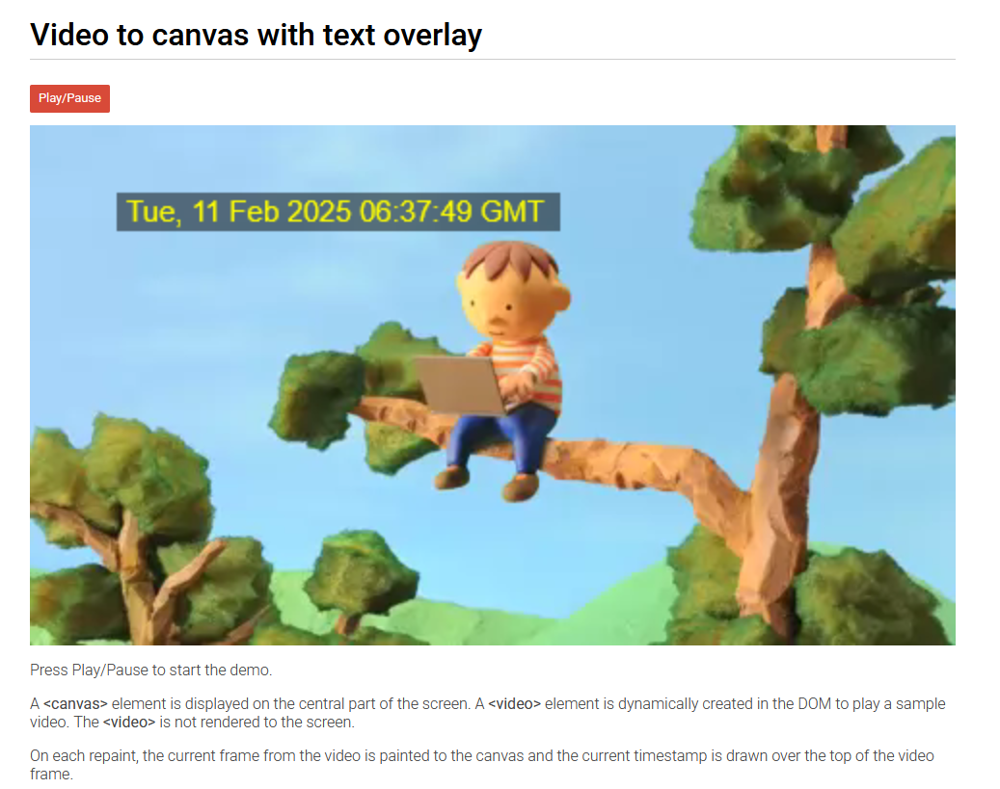

# Video to canvas with text overlay demo app

A demo app showing an offscreen video element being drawn to an onscreen canvas with the date time overlaid on the video frames.

* Clone the repo
* Open index.html in your browser

## Demo

<video src="https://github.com/tonesandtones/video-canvas-overlay/raw/refs/heads/main/demo.mp4"></video>